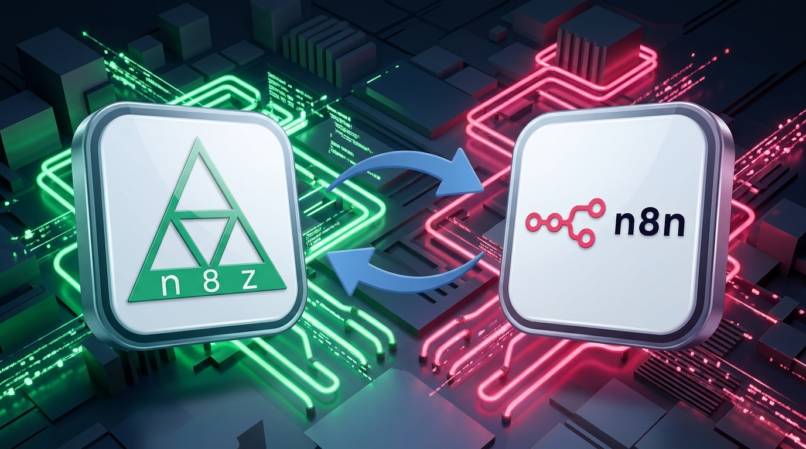
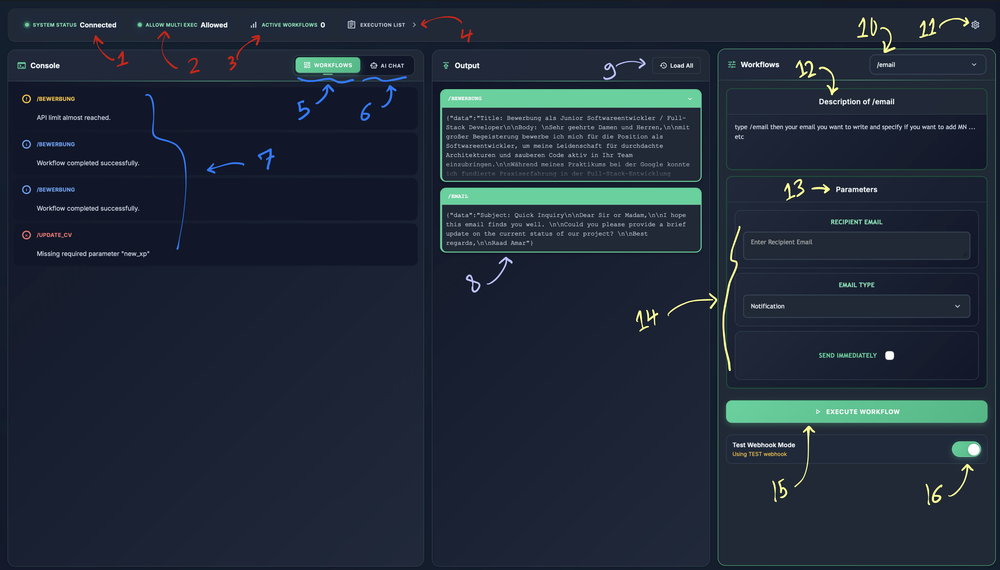
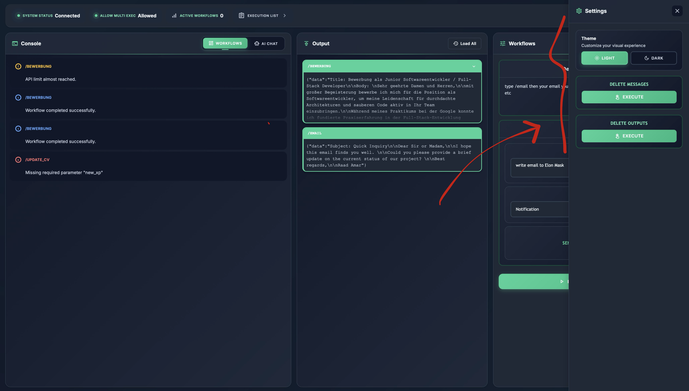
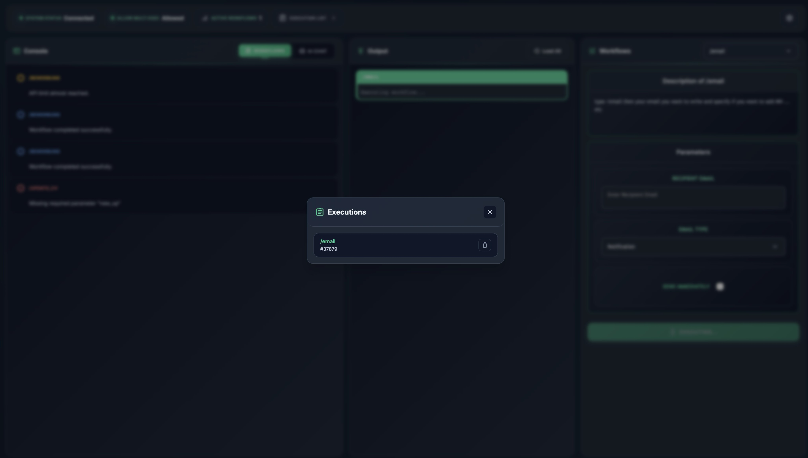
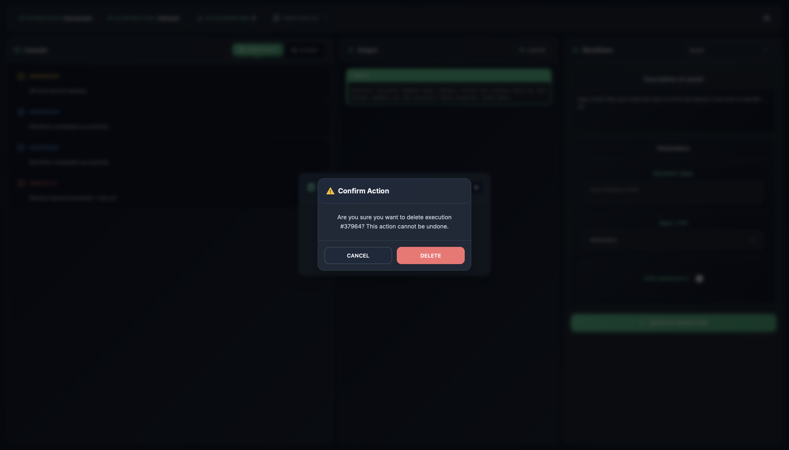

# N8Z - Personal n8n Workflow Dashboard




A lightweight, single-file HTML dashboard for monitoring and executing your n8n workflows in real-time. Built with vanilla JavaScript and CSS—no frameworks, no dependencies. Track workflow executions, manage outputs, chat with your custom AI agents, and monitor your automation work through n8n webhooks. Fully customizable logic without external dependencies.

The code is organized into 12 self-contained sections (documented in comments). Want to modify something? Each section is clearly marked—just find what you need and change it. No complex setup required.

---

## Demo


---

## Quick Links

1. [Overview](#overview)
2. [Security](#security-warning)
3. [Why N8Z?](#why-n8z)
4. [Features](#features)
5. [Dashboard Layout](#dashboard-layout)
6. [How It Works](#how-it-works)
7. [API Configuration](#api-configuration)
8. [Workflow Execution Models](#workflow-execution-models)
9. [Usage](#usage)
10. [Test Webhook Mode](#test-webhook-mode)
11. [Limitations & Future](#limitations--future)
12. [Setup](#setup)
13. [Technical Details](#technical-details)
14. [Design Choices](#design-choices)
15. [AI in Development](#ai-in-development)
16. [License](#license)

---


## Overview

N8Z emerged from a simple problem: after spending countless hours building workflows in n8n, managing them became tedious. Navigating the n8n UI repeatedly to execute workflows, check status, and view results felt unnecessary. This dashboard solves that by providing a single interface focused on one task: executing workflows quickly and monitoring results in real-time.

The system communicates with your n8n instance through webhook endpoints, allowing you to select workflows, fill parameters, execute them, and review outputs—all without leaving the dashboard. It's ideal for solo developers and automation enthusiasts who work with multiple workflows regularly.

---

## Security Warning

**For Personal/Local Use Only.** N8Z has no authentication, rate limiting, or security hardening. Webhook URLs are visible in the browser, API calls happen client-side, and there's no user management. Deploy only on your local machine or trusted internal networks. Do not expose to the internet or use with sensitive data.

---

## Why N8Z?

Executing a workflow from n8n's UI requires navigating through multiple screens and menus. N8Z reduces that to a single click. If you manage 5+ active workflows, seeing them all in one place with real-time status is invaluable. The dashboard also centralizes AI chat, execution history, and output management—eliminating context switching. It's built for speed and simplicity, nothing more.

---

## Features

**Core:** Workflow execution with custom parameters • Real-time execution monitoring • Output history with click-to-copy • AI chat integration • Execution management (stop/delete) • n8n webhook-driven dynamic settings • Test Webhook Mode toggle

**Planned:** File upload/download (images, audio, etc.) 

---

## Dashboard Layout



The dashboard is organized into a top bar and three side-by-side panels. The **top bar** contains the status indicators and controls. Element **1** shows connection status with a green dot (online) or red dot (offline), updating every 2 seconds by calling the System Status webhook. Element **2** is the multi-execution toggle—click it to trigger the Toggle Multi-Exec webhook in n8n, which enables or disables simultaneous workflow execution. Element **3** displays the count of currently active executions returned by the System Status webhook. Element **4** is the execution list button, which opens a modal showing all running workflows with stop/delete options.

The **left panel** functions as a console with two modes accessed via tabs in element **5**. Workflows tab shows element **7**, which displays real-time messages and logs from executing workflows (retrieved by polling the Load Messages webhook every 2 seconds) with color-coded status indicators (success, error, warning, info). Messages are clickable to copy. AI Chat tab shows element **6**, allowing you to interact with connected AI agents by calling the Get Chat Session webhook—N8Z stores conversation history during your session and retries the webhook call up to 10 times if it responds slowly.

The **middle panel** is the output display area. Element **8** shows results from executed workflows (populated after you execute a workflow or call the Load All Outputs webhook) and is clickable to copy. Long outputs are truncated and expandable. Element **9** is the "Load All" button, which triggers the Load All Outputs webhook to retrieve all previous workflow execution results from n8n.

The **right panel** is where you select and execute workflows. Element **10** is a searchable dropdown that populates when the Load Workflows webhook is called on startup, listing your custom selected workflows from n8n (configured via the Load Workflows webhook response). Element **11** is the settings button that opens a panel for theme selection and settings retrieved by calling the Load Settings webhook.
 Element **12** displays a description of the selected workflow, explaining what it does (metadata from the Load Workflows webhook response). Elements **13** and **14** form the parameter section. **Element 13** is the parameter section that dynamically displays based on your selected workflow (configured via the Load Workflows webhook response from n8n). **Element 14** contains the individual parameter inputs within that section, which support three types: text fields for free-form input, dropdown selections for predefined options, and toggle checkboxes for boolean on/off values. Element **15** is the Execute Workflow button. Element **16** is the Test Webhook Mode toggle, allowing you to route executions to a test endpoint (`/webhook-test/`) instead of production, useful for sandbox testing without affecting live workflows.

---



This is the settings panel that can be customized depending on your needs for theme selection and dynamic webhook-driven settings.

---



By clicking the execution list button in the topbar, you can view all currently running workflow executions.

---



By clicking the delete button on an execution, a confirmation dialog appears before removing it.

---

## How It Works

N8Z is a display interface that communicates exclusively with n8n via webhooks. On load, it calls the Load Workflows webhook to fetch available workflows and their parameter definitions from n8n. When you select a workflow and fill parameters, clicking execute calls the Workflow Executor webhook with your parameters. While executing, the dashboard polls the System Status webhook every 2 seconds to retrieve execution status from n8n. All results and data are displayed from n8n—N8Z itself stores nothing; it only pulls and displays information.

The system polls at different intervals: System Status and Load Messages webhooks are called every 2 seconds, Load Settings is called once at startup, and System Status is called every 1 second while the execution list modal is open. Polling automatically pauses when the browser tab loses focus and resumes when you return to the tab—this prevents unnecessary requests to n8n when N8Z isn't actively in use.

---

## Setup

1. Copy the N8Z HTML file to your machine or local server
2. Open it in a modern web browser (Chrome, Firefox, Safari, Edge)
3. Edit the webhook URLs in the JavaScript (top of file, look for the `API` object):

```javascript
const API = {
    SYSTEM_STATUS: 'http://localhost:5678/webhook/YOUR_ID',
    LOAD_WORKFLOWS: 'http://localhost:5678/webhook/YOUR_ID',
    LOAD_MESSAGES: 'http://localhost:5678/webhook/YOUR_ID',
    LOAD_SETTINGS: 'http://localhost:5678/webhook/YOUR_ID',
    GET_CHAT_SESSION: 'http://localhost:5678/webhook/YOUR_ID',
    DELETE_EXECUTION: 'http://localhost:5678/webhook/YOUR_ID',
    LOAD_ALL_OUTPUTS: 'http://localhost:5678/webhook/YOUR_ID',
    TOGGLE_MULTI_EXEC: 'http://localhost:5678/webhook/YOUR_ID'
};
```

Replace `YOUR_ID` with actual webhook IDs from your n8n instance. For details on what each endpoint should provide, see the API Configuration section below. Refresh the browser and you're done.

---

## API Configuration

N8Z requires 8 webhook endpoints from n8n. Configure them in the JavaScript at the top of the file before deployment. Each handles a specific function in the dashboard workflow.

**Endpoint 1: System Status (GET)** returns the current connection state and active execution count. The response includes an array of running workflows (with their exec IDs and names) and a flag for whether multi-execution is permitted. This endpoint powers the topbar indicators and is polled every 2 seconds.

```json
{
  "exec_list": [{"exec_wf_id": "uuid", "exec_wf_name": "Workflow Name"}],
  "allow_multi_exec": true
}
```

**Endpoint 2: Load Workflows (GET)** retrieves all available workflows with their parameter definitions and descriptions. The response includes a list of workflows (each with name, description, trigger link, and parameter array) plus a global executor URL if all workflows share one endpoint. Parameter types are defined as `"textfield"` (text input), an array like `["Option1", "Option2"]` (dropdown), or `"button"` (toggle checkbox). This populates the workflow selector dropdown and parameter form.

```json
{
  "wf_list": [{
    "wf_name": "Process Email",
    "wf_desc": "Processes incoming emails and stores to database",
    "wf_trigger_link": "http://...",
    "use_custom_url": false,
    "wf_param": [
      {"param_name": "Recipient Email", "param_type": "textfield"},
      {"param_name": "Email Type", "param_type": ["Notification", "Marketing", "Support"]},
      {"param_name": "Send Immediately", "param_type": "button"}
    ]
  }],
  "executor_link": "http://..."
}
```

**Endpoint 3: Load Messages (GET)** fetches workflow execution logs with status codes and timestamps. The `message_level` field indicates success ("finished"), failure ("error"), or advisory ("warning", "information"). This endpoint is polled every 2 seconds and powers the left panel console when in workflow mode.

```json
{
  "messages": [{
    "message_id": 1,
    "message_from_wf": "Process Email",
    "message_body_wf": "Email successfully processed",
    "message_level": "finished",
    "message_date": "2024-08-26T14:18:30Z"
  }]
}
```

**Endpoint 4: Load Settings (GET)** returns n8n-driven settings for the settings panel. Supports three types: `text` (user enters a value), `toggle_button` (on/off switch), and `select_button` (dropdown with apply button). Each setting includes a trigger URL to POST when the user modifies it (another n8n webhook). This allows dynamic configuration without redeploying N8Z.

```json
{
  "settings": [
    {"setting_name": "API Key", "setting_type": "text", "trigger_link": "http://..."},
    {"setting_name": "Enable Logging", "setting_type": "toggle_button", "trigger_link": "http://..."},
    {"setting_name": "Retry Count", "setting_type": "select_button", "trigger_link": "http://...", "options": ["1", "3", "5", "10"]}
  ]
}
```

**Endpoint 5: Get Chat Session & Send AI Message (POST)** handles AI chat conversations. Right now, N8Z uses a single hardcoded AI agent ("default"). But the system is designed for future multi-agent support: instead of pointing directly to one chat endpoint, N8Z first asks n8n for a session link. This way, when you add a button to select different AI agents in the UI, n8n can return different links for each one (one for a data analyst, one for a code reviewer, etc.). Currently you can't select agents—that's a future feature—but the webhook structure is already in place for it.

Here's how it works now: POST once to get a session link for the current agent, then reuse that link for all messages in the conversation. If getting the link fails, N8Z retries up to 10 times. Once you have a link, POST each message to it and get responses back. The link is cached and reused until the conversation ends.

Step 1 request (called once per conversation):
```json
{"user_message": "What is the status of my workflows?", "ai_agent_name": "default"}
```
Step 1 response:
```json
{"chat_link": "http://localhost:5678/webhook/chat-session-abc123"}
```
Step 2 request (POST to the cached session URL, called for each message):
```json
{"user_message": "What is the status of my workflows?", "ai_agent_name": "default"}
```
Step 2 response:
```json
{"message": "Your workflows are running normally. 3 executions active."}
```

The session link is cached in memory for the duration of the chat session. Switching tabs or refreshing the page resets the cached link, requiring a new session to be established.

**Endpoint 6: Delete Execution (POST)** stops a running workflow execution immediately. Requires the execution ID (available from the execution list modal). The response just needs to indicate success.

```json
{"exec_id": "execution_uuid"}
```

**Endpoint 7: Load All Outputs (GET)** retrieves the complete output history. Results are returned as an array where each item includes the workflow name, timestamp, output content, and an error flag. This populates the middle panel when the user clicks "Load All".

```json
{
  "outputs": [{
    "id": "output_123",
    "timestamp": "2024-08-26T14:18:30Z",
    "workflow_name": "Process Email",
    "content": "Processing completed successfully. 5 emails processed.",
    "is_error": false
  }]
}
```

**Endpoint 8: Toggle Multi-Execution (POST)** sends a toggle command to n8n to turn multi-execution on or off.

```json
{"action": "toggle"}
```

**Workflow Executor (dynamic endpoint)** executes the selected workflow with user-provided parameters. This can be a global URL (shared by all workflows, specified in Endpoint 2's `executor_link` field) or a per-workflow custom URL (if `use_custom_url` is true). The `command` field must match the workflow name, and `body` contains parameter key-value pairs. Response returns the workflow's output text.

```json
{
  "command": "Process Email",
  "body": {
    "Recipient Email": "user@example.com",
    "Email Type": "Notification",
    "Send Immediately": true
  }
}
```

---

## Workflow Execution Models

N8Z supports two execution strategies, both managed by n8n. **Global Executor** routes all workflows through a single webhook—n8n handles all routing and execution internally. **Per-Workflow Custom URLs** have each workflow point to its own endpoint—useful when workflows need different handlers or security levels. Set `use_custom_url: true` in the workflow definition to configure which endpoint n8n should call.

All execution data is stored by n8n. N8Z retrieves this data by calling n8n webhooks that run workflows to fetch the data from n8n. These workflows return the execution information, which N8Z then displays. Specifically: active executions are retrieved every 2 seconds via the System Status webhook, historical outputs on demand via the Load All Outputs webhook, and real-time logs via the Load Messages webhook. N8Z does not create, modify, or store execution data—it only receives what the n8n webhooks return and displays it.

For complex workflows with multiple stages, create separate n8n workflows for each step in n8n. Add each as a selectable option in N8Z. N8Z will display them and let you execute them by calling their webhooks, but all workflow logic, data processing, and execution happens in n8n.

---

## Usage

**Execute a Workflow:** Select a workflow from the dropdown in the right panel (search by name if needed), review the description, fill in parameters, and click "Execute Workflow". Output appears in the middle panel when complete. Click any output to copy it.

**Monitor Executions:** Click the execution list button in the topbar to see all running workflows. Click the delete icon to stop one (confirm the action in the popup). The list updates every 1 second while open.

**Use AI Chat:** Switch to the AI Chat tab in the left panel, type your question, and press Enter. Click any received message to copy it.

**View History:** Click "Load All" in the middle panel to retrieve all previous outputs. Results display newest first.

**Adjust Settings:** Click the gear icon in the topbar. Select light or dark theme (saved to localStorage) and configure any webhook-provided settings from n8n. Changes apply immediately when you trigger the webhook action.

### Test Webhook Mode

Located below the "Execute Workflow" button, the Test Webhook Mode toggle allows you to route executions to a separate testing endpoint in n8n instead of the production webhook. This is useful for testing workflows without affecting live data.

**How it works:** When toggled ON, N8Z replaces `/webhook/` with `/webhook-test/` in your webhook URL before executing. For example:
- Normal: `http://localhost:6366/webhook/abc123`
- Test: `http://localhost:6366/webhook-test/abc123`

The toggle state is saved to browser localStorage, so it persists across sessions. The indicator shows "Using TEST webhook" (orange text) when active, or "Using normal webhook" when inactive.

**Setup:** Create a duplicate n8n workflow webhook with the `-test` suffix, or configure n8n to handle `/webhook-test/` requests separately for testing.

---

## Limitations & Future

N8Z is intentionally minimal and personal-use-only. There's no multi-user support, authentication, or rate limiting. Webhook URLs are visible in the browser, parameters are limited to text/select/toggle types, and there's no file upload support or execution scheduling yet. Use only on local or trusted networks—do not expose to the internet.

**Current Tradeoffs:**
Polling retrieves System Status and Load Messages every 2 seconds when the browser tab is active—this keeps the dashboard current without manual refresh, but adds load to n8n. Polling stops automatically when you leave the tab, reducing overhead during idle time.

**Planned Improvements:**
- **Native n8n API Integration OR Backend Polling Server:** Either build direct n8n API integration to eliminate webhook customization and scan everything natively, or consolidate polling from multiple N8Z instances into a single backend server, reducing webhook calls.
- **AI Agent Selection:** Dropdown to switch between different AI agents instead of hardcoding "default".
- **File Upload/Download:** Transfer files to/from n8n workflows.
- **Execution Scheduling:** Schedule workflows to run at specific times.
  
---

## Design Choices

N8Z was built in 3 days as a personal automation tool. Given that tight timeline, vanilla JavaScript and CSS were the only option—no frameworks, no build pipeline, no dependencies. For quick development and instant deployment, vanilla is ideal: single HTML file, instant load, zero setup. This forced simplicity paid off: the entire dashboard works without any external tools or npm packages.

The API design works but isn't strict. Endpoints expect flexible response formats (some fields are optional, naming varies). With more time, I'd enforce stricter contracts—consistent naming conventions, required fields, versioning. This would make the codebase more maintainable as workflows grow.

The UI is functional and responsive, but purely manual DOM manipulation. If I had more time, I'd seriously consider Next.js or React or Vue.js. They would handle state management better, make components reusable, and simplify async logic (especially the AI chat retry logic). React's component structure would make the settings panel and execution modals cleaner.

But vanilla was the right call for this specific problem: fast iteration on a personal tool within a tight deadline, zero deployment complexity, and the ability to drop it anywhere without npm or build tools. Plus, AI tools can generate vanilla JavaScript and CSS instantly without needing to specify framework setup—just plain code that works immediately.

---

## AI in Development

The LLM **Claude AI - Haiku 4.5** (Anthropic) was used during the development to generate code snippets to be directly integrated in the project. This approach was helpful for quick integration.

**Ideal Next Version:**
With more time (one to two weeks), systematically design UI mockups in Figma, document strict API contracts with JSON schemas, then generate a full React/Vue.js application in one go—properly structured, typed, and tested. This eliminates ad-hoc decisions and results in a production-ready codebase.

---

## License

**Version:** 1.0 • **Updated:** August 2024 • **License:** Free to share and use, no commercial use.
